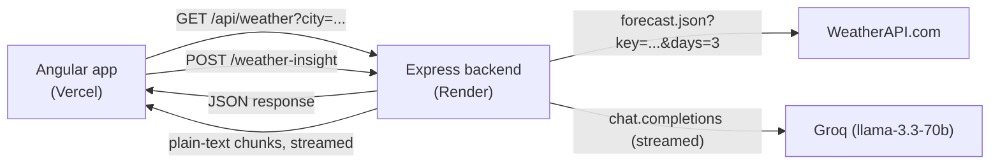

# 1. Architecture — The Big Picture

## Why does a weather app need its own backend?

WeatherAPI and Groq (the AI provider) both work by giving you a **secret API
key** that you attach to every request. If the Angular app called those services
*directly* from the browser, that key would sit in plain sight in the browser's
network tab — anyone visiting the site could copy it and use it as their own,
potentially running up your usage or exhausting your free-tier quota.

The fix is a thin backend **proxy**: the browser only ever talks to *your own*
Express server, and that server — running somewhere the public can't inspect its
source or environment variables — is the only thing that ever sees the real
`WEATHER_API_KEY` and `GROQ_API_KEY`. This is the main reason the backend
exists; beyond that, it also caches responses and rate-limits requests, both
covered in [02-BACKEND.md](./02-BACKEND.md).

## The three services



| Piece | What it is | What it's responsible for |
|---|---|---|
| **Angular app** (`src/app`) | Everything the user sees | The dashboard, every widget, all client-side state |
| **Express backend** (`server/index.js`) | A small Node server | Proxies WeatherAPI + Groq, hides both API keys, caches responses, rate-limits requests |
| **WeatherAPI.com** | Third-party weather data provider | Current conditions, forecast, city search |
| **Groq** | Third-party AI inference provider | Generates the short natural-language "insight" sentence |

## What happens when you search a city

1. You type a city name (or the app tries your browser's geolocation first — see
   [03-FRONTEND.md](./03-FRONTEND.md)).
2. Angular's `WeatherService` calls `GET /api/weather?city=<name>` — note there's
   no API key anywhere in this request; the browser doesn't know it and doesn't
   need to.
3. The Express backend checks its in-memory cache first (see
   [02-BACKEND.md](./02-BACKEND.md)); on a miss, it attaches `WEATHER_API_KEY`
   and calls WeatherAPI's real endpoint on the app's behalf:
   `forecast.json?key=...&q=<city>&days=3&aqi=yes`.
4. WeatherAPI's raw JSON comes back through the backend, unmodified, straight to
   the browser.
5. `WeatherService` reshapes that (fairly large, deeply-nested) raw response into
   the smaller, purpose-built shapes each widget actually needs (`WeatherData`,
   `ForecastHour[]`, `DailyForecast[]`, ...) — see
   [03-FRONTEND.md](./03-FRONTEND.md) for exactly how.
6. Separately, and concurrently, the dashboard also fires a
   `POST /weather-insight` request with the now-known temperature/condition/
   humidity/wind, and the backend streams back a short AI-written sentence about
   how the weather *feels*, word by word, as Groq generates it — see
   [02-BACKEND.md](./02-BACKEND.md).

## Repo layout

```
nimbus-ai/
  server/
    index.js              # the entire Express backend — one file
  src/
    app/
      core/services/
        weather-ai.service.ts    # talks to POST /weather-insight, consumes the stream
      features/weather/
        services/
          weather.service.ts     # talks to GET /api/weather and /api/weather/search
          weather.service.spec.ts # real tests for the response-mapping logic
        models/                  # the frontend's own clean data shapes
        pages/weather-dashboard/ # the one page — owns almost all app state directly
        widgets/                 # one folder per visual widget (see 04-FEATURES.md)
    environments/                # local vs production API URLs
  .github/workflows/build.yml    # CI: confirms the app still builds on every push
```

There's no server-side database anywhere in this project — the backend never
remembers anything between requests except a short-lived cache. The one thing
that *is* remembered across visits — your last few searched cities — lives
entirely in the browser's own `localStorage`, not on any server; see
"Remembering recently searched cities" in [03-FRONTEND.md](./03-FRONTEND.md).

Next: [02-BACKEND.md](./02-BACKEND.md) — the Express server, in full.
