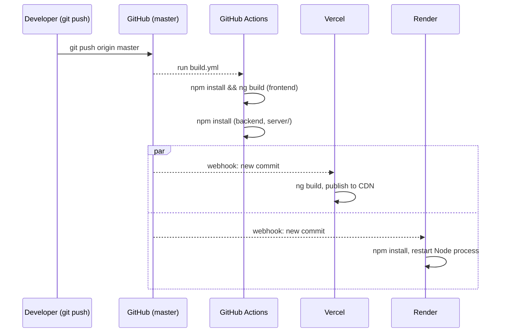

# 5. Deployment — Three Separate Pieces, Three Separate Homes

## Where each piece lives

| Piece | Hosted on | Deploys on |
|---|---|---|
| Angular frontend | **Vercel** | push to `master` |
| Express backend | **Render** | push to `master` |
| — | **GitHub Actions** | push to `master` — build validation only, not a deploy |

Vercel and Render both watch the same repository and branch independently, and
neither one depends on GitHub Actions to succeed first — **GitHub Actions here
is a build-health check, not a deployment gate.** If `build.yml` fails, Vercel
and Render still deploy; the workflow exists so a broken build is visible in the
GitHub Actions tab (and in a pull request's checks) without needing to wait for
either host's own build logs.

## Environment variables

Two secrets, `GROQ_API_KEY` and `WEATHER_API_KEY`, are needed only by the
backend (the frontend never sees them — see
[01-ARCHITECTURE.md](./01-ARCHITECTURE.md) for why). Locally they live in
`server/.env` (gitignored); on Render they're set as environment variables in
the service's own dashboard, the same names, read the same way via
`dotenv`/`process.env`.

The frontend has its own environment split instead —
[`environment.ts`](../src/environments/environment.ts) (local dev, pointing at
`http://localhost:3000`) vs
[`environment.prod.ts`](../src/environments/environment.prod.ts) (pointing at
the real Render URL) — swapped automatically by `ng build` depending on whether
it's a development or production build.

## A real lesson from deploying behind Render's proxy

When rate limiting (see [02-BACKEND.md](./02-BACKEND.md)) was first added and
deployed, Render's logs immediately showed a `ValidationError` — 
`ERR_ERL_UNEXPECTED_X_FORWARDED_FOR` — on every single request. Requests still
worked, but the rate limiter couldn't reliably tell one visitor's IP address
from another's.

The cause: Render (like most hosting platforms) puts the app behind its own
reverse proxy, which adds an `X-Forwarded-For` header carrying the visitor's
real IP. Express doesn't trust that header by default — a malicious client
could set it to anything — so without being told otherwise, it ignores it,
and `express-rate-limit` has no safe way to key its limits by client. The fix
is one line, `app.set('trust proxy', 1)`, telling Express "the first proxy
hop really is Render's own infrastructure, trust its `X-Forwarded-For`
value." This is exactly the kind of bug that's invisible locally (there's no
proxy in front of `localhost`) and only appears once the app is actually
running behind one — worth knowing about before adding rate limiting to *any*
Express app destined for a platform like Render, Heroku, or Railway.

## The Render free-tier cold start

The backend runs on Render's free tier, which spins the service down after a
period of inactivity and takes a few seconds to spin back up on the next
request. This is why the very first search after the site's been idle for a
while can feel noticeably slower than every search after it — it isn't a bug in
this project's code, it's the tradeoff of the free hosting tier. The
`README.md`'s "Live Demo" section calls this out directly, and the dashboard
itself shows a short explanatory banner if a search is taking unusually long
(see [04-FEATURES.md](./04-FEATURES.md)) so it isn't mistaken for a real
performance problem.

## What a full local run looks like

1. **Backend:** `cd server`, `npm install`, create `server/.env` with
   `GROQ_API_KEY` and `WEATHER_API_KEY`, then `npm run dev`. Listens on
   `http://localhost:3000`.
2. **Frontend:** from the repo root, `npm install`, then `ng serve`. Listens on
   `http://localhost:4200` and talks to the backend at the URL in
   `environment.ts`.

Both need to be running together — the dashboard's search box works with the
backend down, but every search will fail without it.

Running the test suite (`ng test`) doesn't need either server running — it
mocks all HTTP calls (see "Testing the mapping logic" in
[03-FRONTEND.md](./03-FRONTEND.md)).

Next: [GLOSSARY.md](./GLOSSARY.md) — every term used across these docs, defined
plainly.
